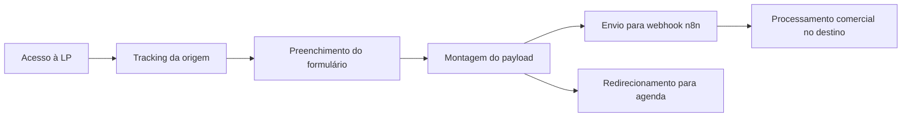

# DiagnosticoAds

> Landing page privada para captação e qualificação de leads de diagnóstico estratégico em marketplaces.


README de apresentação para GitHub.  
A documentação técnica oficial e completa permanece em [docs/DOCUMENTACAO_OFICIAL.md](./docs/DOCUMENTACAO_OFICIAL.md).

## Visão do Projeto
O **DiagnosticoAds** foi desenhado para transformar tráfego em leads qualificados, conectando aquisição, coleta de dados e agendamento comercial em um único fluxo.

### O que o sistema resolve
- Evita perda de lead entre formulário e agendamento.
- Centraliza captação com dados de contexto comercial.
- Preserva origem de tráfego para análise de performance.
- Entrega o lead para automação operacional (n8n) com baixa fricção.

## O Que Foi Desenvolvido
### 1. Captação e Tracking 
- Captura de origem (`channel`, `source`, `medium`, `campaign`) via script de bootstrap.
- Persistência de tracking no navegador para reaproveitamento no submit.

### 2. Formulário de Qualificação
- Captura de nome, e-mail, WhatsApp, faixa de investimento e canais de venda.
- Validação local de consistência de telefone.
- Interface responsiva para mobile e desktop.

### 3. Integração com Automação
- Envio de payload para webhook n8n.
- Estratégia resiliente de envio: `sendBeacon` com fallback `fetch keepalive`.
- Redirecionamento para agenda após tentativa de envio.

### 4. Jornada de Conversão
- Sequência de seções orientada à tomada de decisão.
- CTA principal para agendamento imediato.
- Blocos de autoridade, análise e escassez para qualificação de interesse.

## Stack Técnica
- **Frontend:** React 18, TypeScript, Vite 6
- **UI/Estilos:** CSS custom, Tailwind CSS v4, tw-animate-css
- **Integração:** Webhook n8n + redirecionamento Google Calendar
- **Deploy:** Vercel + build estático para HostGator/cPanel

## Arquitetura (Resumo)
| Camada | Responsabilidade |
| --- | --- |
| `src/sections` | Seções funcionais da landing (narrativa e conversão) |
| `src/lib` | Regras utilitárias (tracking e WhatsApp) |
| `src/config` | Configuração de runtime por variáveis de ambiente |
| `src/styles` | Tema, tipografia e responsividade |
| `public` | Scripts/arquivos estáticos de apoio ao deploy |

## Funcionamento do Sistema
1. Usuário acessa a LP.
2. Script de tracking inicializa e persiste origem da sessão.
3. Usuário preenche formulário de qualificação.
4. Aplicação monta payload com dados de contato + tracking.
5. Lead é enviado ao webhook n8n.
6. Usuário é redirecionado para agendamento.



## Diferenciais de Engenharia
- Captura de tracking antes do bootstrap do React.
- Envio resiliente para reduzir perda de lead na navegação.
- Estrutura enxuta e modular para manutenção rápida.
- Build preparado para Vercel e publicação estática em HostGator.

## Estrutura do Projeto
```text
.
├─ src/
│  ├─ assets/
│  ├─ config/
│  ├─ lib/
│  ├─ sections/
│  ├─ styles/
│  ├─ App.tsx
│  └─ main.tsx
├─ public/
│  ├─ 01.png
│  ├─ tracking.js
│  └─ htaccess-hostgator.txt
├─ docs/
│  ├─ DOCUMENTACAO_OFICIAL.md
│  ├─ TECHNICAL_GUIDE.md
│  ├─ AUTOMACAO_N8N.md
│  ├─ ENGINEERING_REVIEW.md
│  └─ DIAGRAMS.md
├─ ads.html
├─ index.html
├─ vite.config.ts
├─ vercel.json
└─ .env.example
```

## Execução Local
```bash
npm install
npm run dev
```

## Build de Produção
```bash
npm run build
```

## Variáveis de Ambiente (Essencial)
- `VITE_CALENDAR_URL`
- `VITE_LEAD_WEBHOOK_URL`

Base de configuração: [.env.example](./.env.example)

## Deploy
- **Vercel:** integração com repositório para deploy contínuo.
- **HostGator/cPanel:** publicação manual dos arquivos de build estático.

## Licença
A licença **permanece inalterada** e segue os termos proprietários definidos em [LICENSE](./LICENSE).
