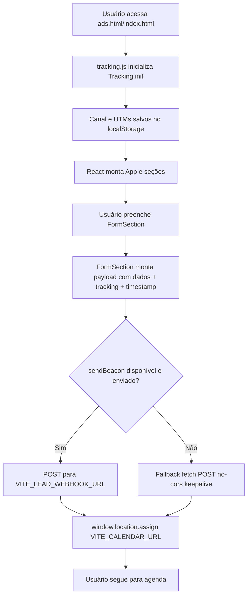
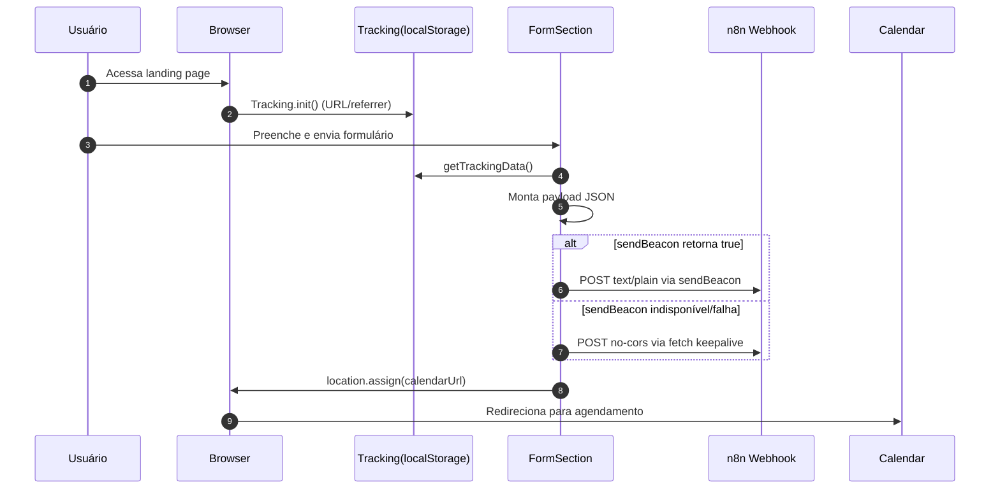

# DOCUMENTAÇÃO OFICIAL DO PROJETO

## AUTORA

Taynara Correia de Souza

## CONTATO

[taynara.souza.dev@gmail.com](mailto:taynara.souza.dev@gmail.com)  
+55 (19) 93500-3600

---

## Diagrama de Fluxo Principal (Mermaid)

---

## Diagrama de Sequência do Submit

---

## Legenda de Componentes

| Elemento | Descrição |
| --- | --- |
| `tracking.js` | Resolve e persiste origem do tráfego |
| `FormSection` | Núcleo da captura, validação e envio de lead |
| `VITE_LEAD_WEBHOOK_URL` | Endpoint de entrada da automação |
| `VITE_CALENDAR_URL` | Destino final da navegação após submit |
