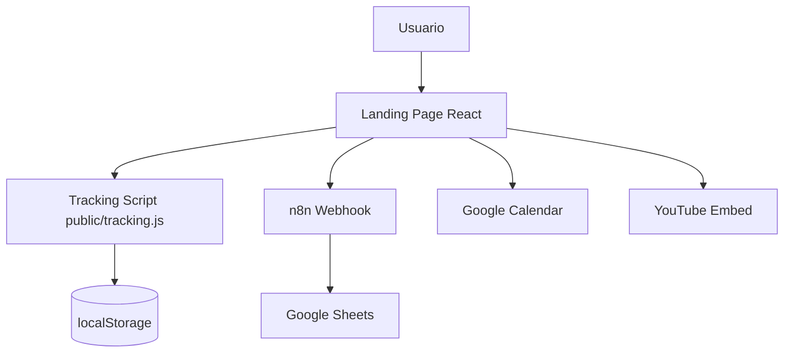
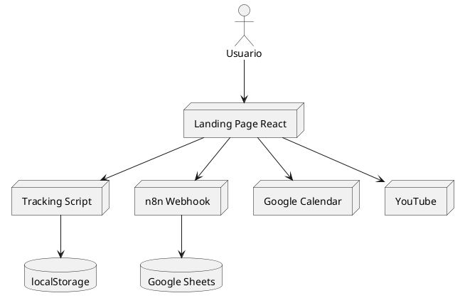
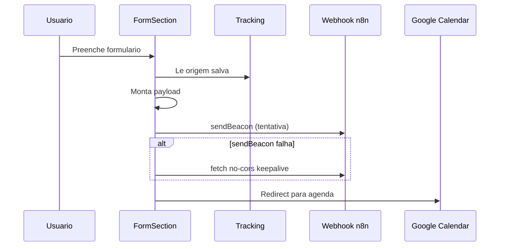
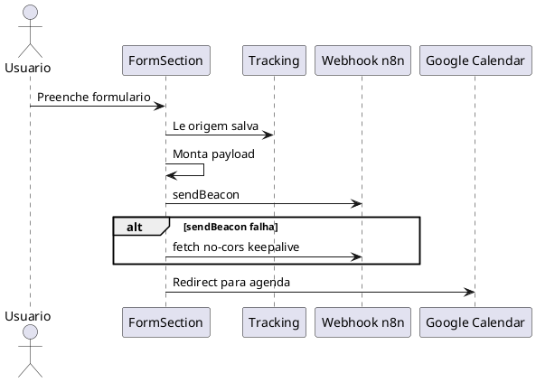
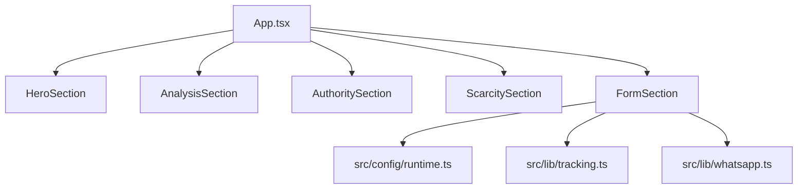
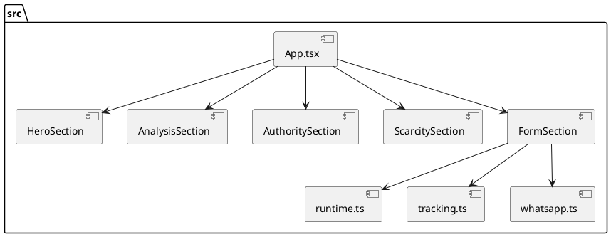

# Diagramas Técnicos

Data: 2026-04-02  
Projeto: DiagnósticoAds

## 1) Diagrama de Arquitetura

### Mermaid

### PlantUML

## 2) Diagrama de Fluxo

### Mermaid

### PlantUML

## 3) Diagrama de Componentes

### Mermaid

### PlantUML

