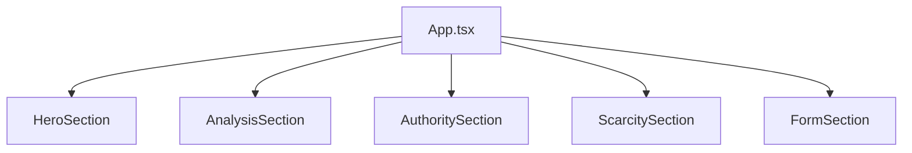

# Diagramas - DiagnosticoAds

Projeto: DiagnosticoAds  
Data: 19/03/2026  
Responsavel tecnico: Taynara Correia de Souza

## Diagrama 1 - Fluxo de usuario
```mermaid
flowchart TD
  A[Usuario acessa landing page] --> B[Captura origem (channel/UTM)]
  B --> C[Clique no CTA]
  C --> D[Formulario]
  D --> E[Envio de payload com tracking para n8n]
  E --> F[Redirect para Google Calendar]
```

## Diagrama 2 - Fluxo de integracao
```mermaid
flowchart TD
  A[Front-end React] -->|POST text/plain (lead + tracking)| B[n8n Webhook]
  B --> C[Normalizacao de dados]
  C --> D[Google Sheets - Append Row]
```

## Diagrama 3 - Estrutura de componentes

