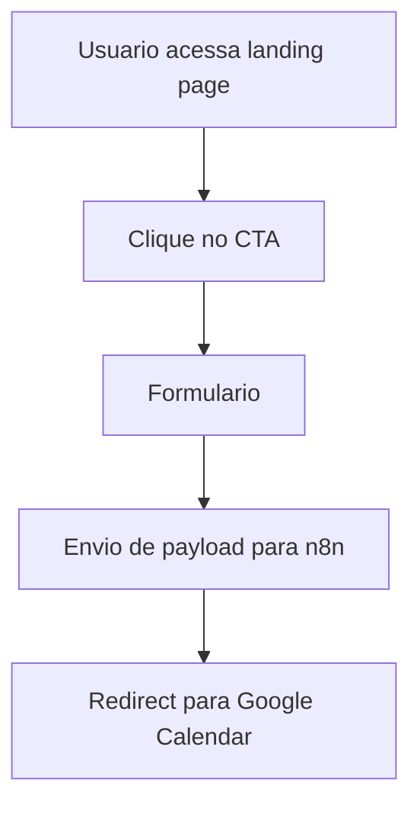
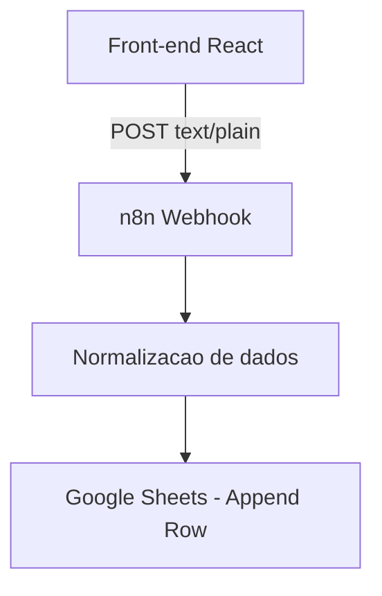
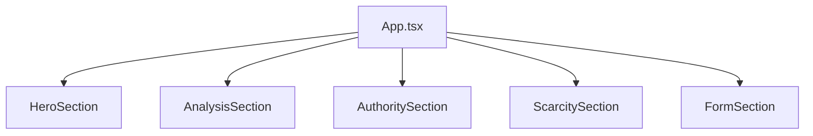

# Diagramas - DiagnosticoAds

Projeto: DiagnosticoAds  
Data: 19/03/2026  
Responsavel tecnico: Taynara Correia de Souza

## Diagrama 1 - Fluxo de usuario

## Diagrama 2 - Fluxo de integracao

## Diagrama 3 - Estrutura de componentes

